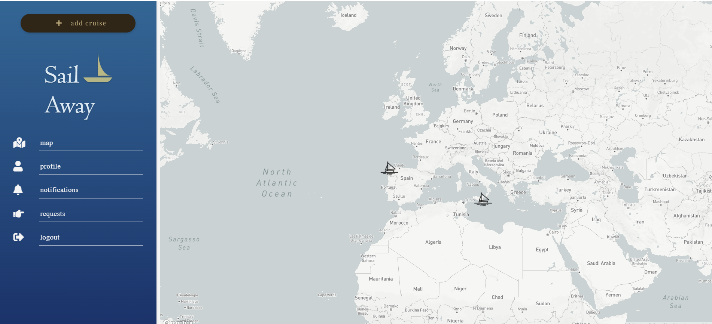
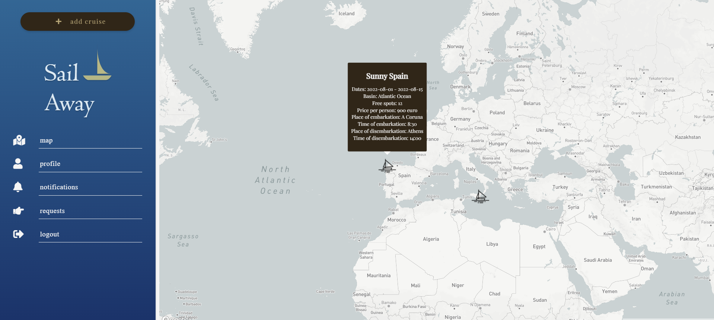
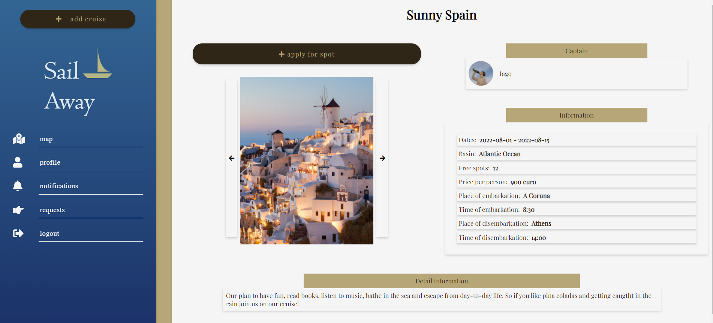
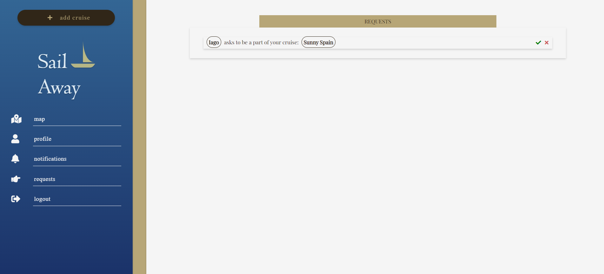
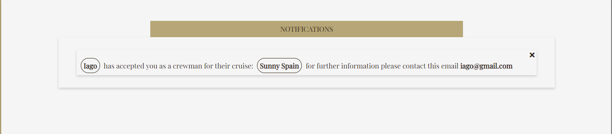
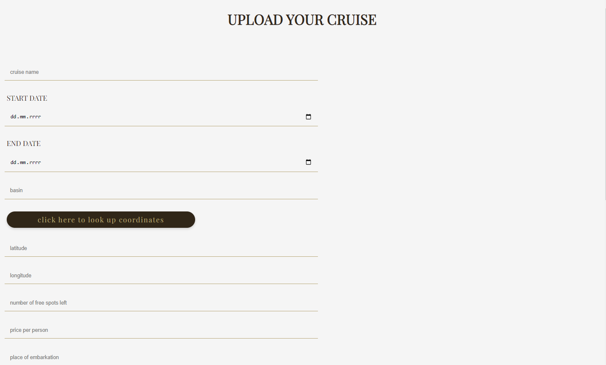

# SailAway
*helping sailors find crews*

## Purpose of the project
Creating an application that connects people all around the world helping them find crews and cruises to join.

## Technologies
- html
- php
- sass css
- javascript
- docker

## To start the application
If you are the owner open code in envionment such as php storm or visual studio code and type *docker-compose up* the app should be running on port 8080. 
If you are an user simply register, log in and have fun!

## Funcionalities
After succesfully registering and logging you will see a map with cruises placed on it

If you hover over the cruise you can see the details of the cruise 

When you click on the cruise you can see it's full description You can apply to get on a cruise with the *apply for spot* button.

The owner of the cruise will see in his requests site that you applied for it. He can Either reject or confirm it by clicking one of the buttons on the right

In your notifications you can check if your request has been confirmed or rejected. If it's confirmed you will get an email of your future captain.

 You can create your own cruise by clicking *add cruise button*
 
